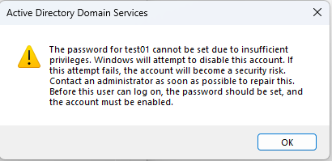
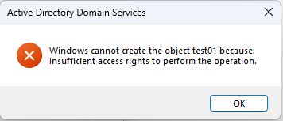
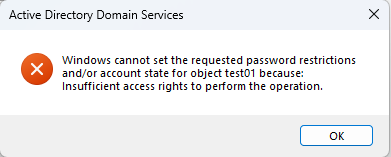

# Delegate-UA-Create.ps1

## Synopsis

This PowerShell script delegates "Create Child" permissions to an Active Directory role (group) for a specific Organizational Unit (OU). This allows members of the role to create new user objects within the designated OU.

## Notes

This script adds a note to the role's description field for audit and tracking purposes.

## Expected Behaviour

When creating a new user object using this script, Active Directory might display errors related to insufficient permissions to set the password or other attributes. As a result, the newly created account will be disabled. This is expected behavior and is designed to ensure least privilege.





If this is the only role granted to a group, those users will only be able to create user accounts, but will not have permissions to perform other actions like modifying passwords or attributes. This effectively limits the potential impact of compromised accounts, as they are restricted to the most basic actions.

To enable the newly created user account and configure additional permissions, either delegate those permissions to another group or user with broader privileges, or add those permissions to the current group.

## Parameters

* **`-role_name`**: Name of the role (AD group) to which permissions are delegated. (Mandatory, Position 0)
* **`-ou`**: Distinguished name of the Organizational Unit (OU) where permissions are delegated. (Mandatory, Position 1)
* **`-WhatIf`**: Simulates changes without actually modifying Active Directory. (Optional)

## Example

```powershell
Delegate-UA-Create -role_name 'Helpdesk_Tier1' -ou 'OU=Standard Users,DC=contoso,DC=com'
```

## Version

1.0

## Author

M. Zaikin

## Disclaimer

This script is provided "AS IS" without warranty of any kind, express or implied, including but not limited to the warranties of merchantability, fitness for a particular purpose and noninfringement. In no event shall the author or copyright holder be liable for any claim, damages or other liability, whether in an action of contract, tort or otherwise, arising from, out of or in connection with the script or the use or other dealings in the script.
